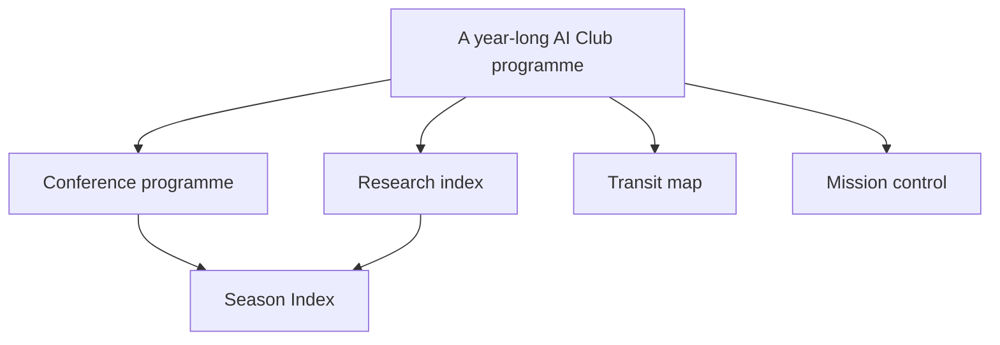

# Artistic direction — AI Club Season Index

**Status:** selected direction for design exploration, 29 September 2026. This document sets the visual approach before any UI code or session schedule exists.

## The design question

How can a visitor understand nine months of events across three parallel tracks in under a minute, then read one month's sessions comfortably? The interface must convey a serious engineering programme without feeling like an admin dashboard or a formal course platform.

## Tree of thoughts

Each branch was tested against the same constraints: whole-season comprehension, three parallel tracks, mobile and keyboard use, growth to voting/materials, and maintenance by a small team.

| Branch | What it gives us | Where it breaks | Decision |
| --- | --- | --- | --- |
| **Conference programme** | Clear dates, formats, presenters, and editorial rhythm | Can become a generic event-card catalogue | Keep its navigational clarity |
| **Research index / field guide** | Distinctive typography, taxonomy, precise metadata, durable archive | Can feel too academic or require excessive annotation | Keep its visual language, edit it down |
| **Transit map** | An immediate visual metaphor for parallel tracks | Twenty-seven possible cells become tiny; lines imply a required route; mobile labels are difficult | Reject as primary UI; use only subtle lane rules |
| **Mission control** | Strong technical identity and useful status signals | Dense instrumentation would bury sessions under indicators | Reject for attendee V1; perhaps use restraint in future organizer tools |

**Chosen synthesis: Season Index.** Conference programme for navigation, research index for hierarchy and material quality. The result should feel like a carefully edited annual programme that engineers want to keep open.

This is a design hypothesis. Test it with real session titles, including long titles, multiple sessions in one cell, empty months, and French-length labels before calling the direction settled.

## Visual thesis

- **Mood:** considered, curious, technical, welcoming.
- **Metaphor:** an annual index with month chapters and three consistent lanes.
- **Texture:** paper-like canvas, strong typography, precise rules, generous space. No simulated notebook stains or faux lab stamps.
- **Identity:** AI Club has its own visual language. Use an official SFEIR logo asset if approved, as an endorsement in the header or footer; do not redraw it or assume this palette is SFEIR's corporate palette. SFEIR provides official logo variants through its [press resources](https://www.sfeir.com/sfeir/presse/).

## Information choreography

The homepage should reveal the entire season immediately:

1. **Masthead:** AI Club / SFEIR Luxembourg; Season 2026–2027; one-sentence editorial promise.
2. **Season index:** October through June across time, with Foundations, Engineering, and Deep Dive as rows. Cells show presence or count and link to that month. This is an overview, not a grid of miniature full cards.
3. **Next confirmed event:** a modest strip with verified date and title. If none is confirmed, say so.
4. **Month chapters:** nine readable sections in chronological order. Within each, the three tracks stay in a consistent order. Session cards carry actual titles, summaries, dates when confirmed, format, and explicit status.
5. **Footer:** source and club context, with only approved links.

At desktop widths, the index fits nine compact month columns because cells contain counts or marks, not titles. Month chapters can use three track columns. At medium widths, split the index into three three-month blocks. On mobile, use month anchors in a compact grid and stack the three tracks under each month; all content remains readable without horizontal page scrolling.

Do not automatically collapse months. A visitor should be able to scroll the whole programme, and direct month links should work without client state.

## The visual grammar

- The season title is expressive; session content is matter-of-fact.
- Large month numerals and quiet metadata provide rhythm. Dates are information, not decoration.
- Track names are always written out. Colour reinforces them but never replaces the label.
- Proposed sessions look provisional through a dotted rule and the word **Proposed**. Scheduled sessions show a confirmed date. Completed and cancelled sessions retain legible titles with explicit labels.
- A blank month/track cell means there is no entry in the current plan. It is not a disabled button or a cancelled talk.
- Use fine architectural rules, never lines that suggest prerequisites or a required learning route.
- The primary action in V1 is to navigate the programme. No inactive voting controls or “coming soon” replay buttons.

## Three quick stress tests

| Scenario | What the design must do |
| --- | --- |
| Four Engineering talks in March, none in Deep Dive | Show a count of four in the index and four readable cards in March; let the empty Deep Dive lane remain visible without a fake placeholder event. |
| A proposal has a target month but no day or presenter | Show “Proposed for March” and no invented calendar date or profile link. |
| A title is long or the interface later uses French | Wrap naturally; never truncate the only readable title or bake words into an illustration. |

## Imagery and illustration

The V1 timeline needs no hero artwork. If imagery is introduced for individual sessions later, it should clarify a concept through an original diagram, object, or editorial metaphor. Avoid glowing brains, robot mascots, stock office scenes, neon circuitry, and illustrations that contain essential text. Portraits and replay thumbnails belong to the later materials phase, subject to permission.

## How the direction extends

- **Voting:** a future ballot uses the same session card, then adds one clear selection control and a transparent selected state. Voting is never represented by applause, popularity fireworks, or a leaderboard.
- **Presentations and replays:** resources appear as a small, labelled list attached to the session. A recording thumbnail is supplementary; the title, duration, and access rules remain text.
- **SFEIR Institute:** future contextual learning links use a separate, clearly identified block, not an advertisement inserted among club sessions.

See [DESIGN_SYSTEM.md](DESIGN_SYSTEM.md) for exact tokens and component behavior.
