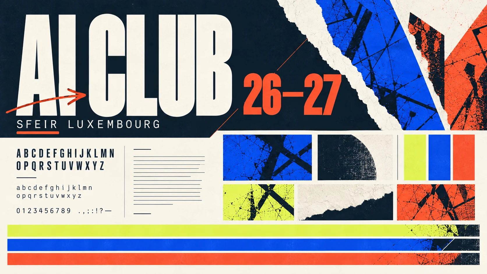
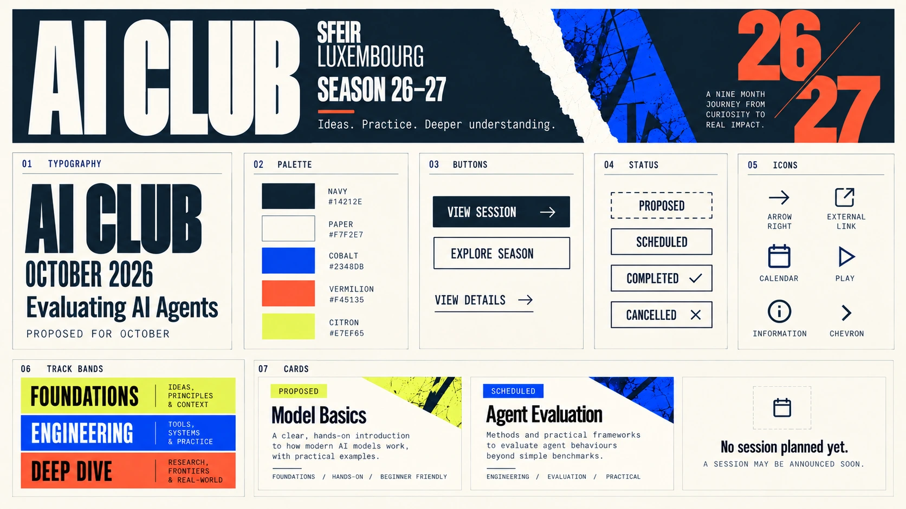

# Signal Index layout references

These images are **visual references**, generated on 29 September 2026 for AI Club / SFEIR Luxembourg. They are not screenshots of an implemented application. Session names, months, counts, statuses, presenter names, links, and media are illustrative placeholders; the real season comes from validated content files. V1 publishes programme and session details without presenter identity.

| Reference | Phase | What to evaluate |
| --- | --- | --- |
| [Moodboard](signal-index-moodboard.webp) | Direction | Typography, paper/ink contrast, print texture and color rhythm |
| [One-sheet UI specimen](signal-index-ui-sheet.webp) | V1 visual guide | Type hierarchy, palette, buttons, status treatment, track bands, cards and icons |
| [Original concept](signal-index-concept.webp) | Direction | Bold masthead, palette, typography; its fully populated matrix is intentionally not the V1 data model |
| [Desktop season](season-desktop.webp) | V1 | Whole-season scan, three tracks, compact index, next event, cards |
| [Mobile season](season-mobile.webp) | V1 | Month jump grid, stacked tracks, empty state, proposal without date |
| [Voting concept](voting-concept.webp) | V2 future | One-choice ballot for eligible SFEIR accounts; no backend or voting rules implemented |
| [Session replay concept](session-replay-concept.webp) | V3 future | Replay and presentation layout; no recording or material is implied to exist |

## Moodboard and component specimen

## Overview

## Mobile

## Future voting

## Future session materials

## Original direction

The reference images establish visual character and hierarchy. The [implementation guide](../README.md) defines implementable colours, type, components, status language, icons, responsive behaviour, and accessibility requirements. The one-sheet specimen is generated artwork: its sample card status chips and example content are illustrative, not canonical CSS or event data. Where an image and the written specification differ, the written specification and real programme data take precedence. Official SFEIR logo use requires an approved asset.
