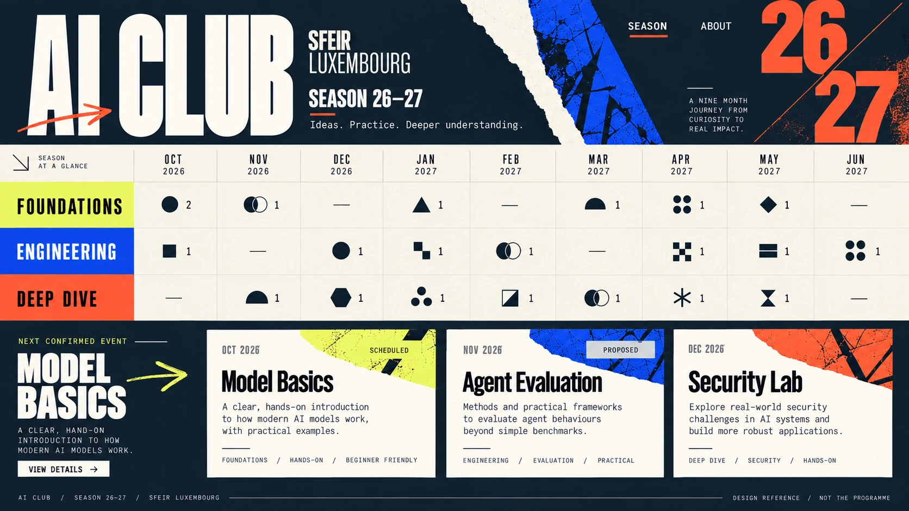
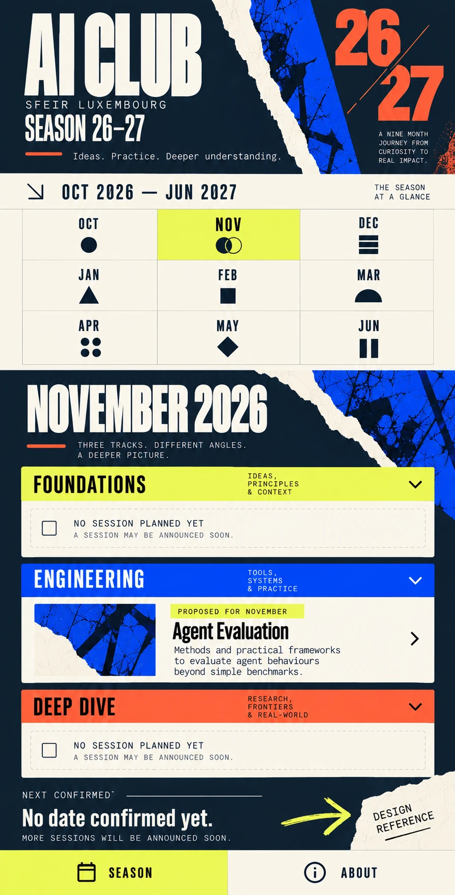
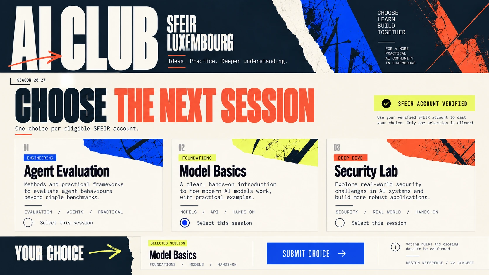
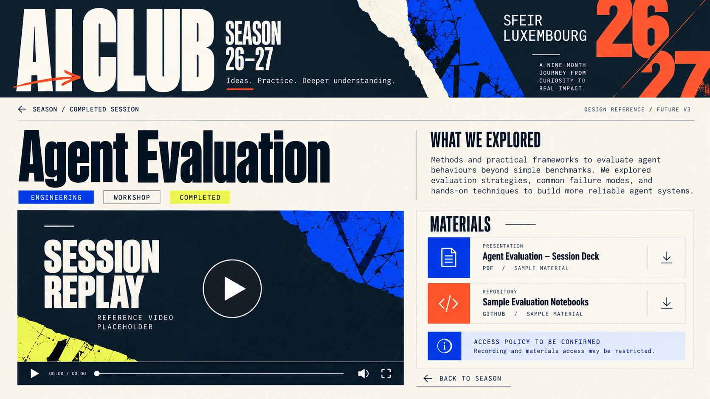
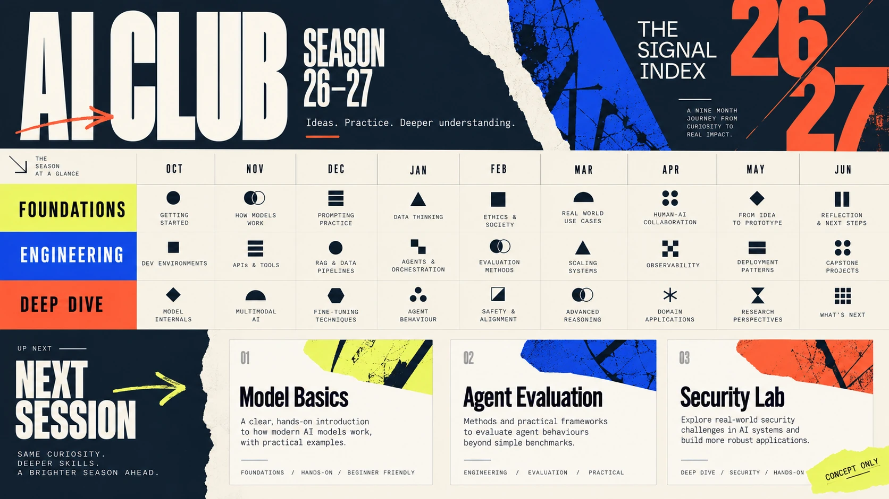

# Signal Index layout references

These five images are **visual references**, generated on 29 September 2026 for AI Club / SFEIR Luxembourg. They are not screenshots of an implemented application. Session names, months, counts, statuses, presenter names, links, and media are illustrative placeholders; the real season comes from validated content files. V1 publishes programme and session details without presenter identity.

| Reference | Phase | What to evaluate |
| --- | --- | --- |
| [Original concept](signal-index-concept.webp) | Direction | Bold masthead, palette, typography; its fully populated matrix is intentionally not the V1 data model |
| [Desktop season](season-desktop.webp) | V1 | Whole-season scan, three tracks, compact index, next event, cards |
| [Mobile season](season-mobile.webp) | V1 | Month jump grid, stacked tracks, empty state, proposal without date |
| [Voting concept](voting-concept.webp) | V2 future | One-choice ballot for eligible SFEIR accounts; no backend or voting rules implemented |
| [Session replay concept](session-replay-concept.webp) | V3 future | Replay and presentation layout; no recording or material is implied to exist |

## Overview

## Mobile

## Future voting

## Future session materials

## Original direction

The reference images establish visual character and hierarchy. [The design system](../../DESIGN_SYSTEM.md) defines the implementable colours, status language, responsive behaviour, and accessibility requirements. Where an image and the written specification differ, the written specification and real programme data take precedence. Official SFEIR logo use requires an approved asset.
